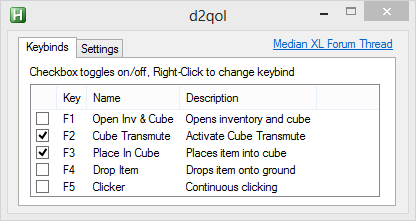

## d2QoL
Median XL's end-game requires highly repetitive crafting mechanics. Working with the cube slowly not only eats away at game time, but can also cause physical stress on the wrists and fingers. Since the nature of these actions is so well defined, it makes perfect target for automation. This was designed foremost as a crafting QoL utility, but it easily extends out to enhance normal gameplay.

This utility does nothing more than clicks on command in locations you have specified. There is no memory peeking, no gameplay logic, nothing outside the capabilities a human can perform.

### Install
Download [d2qol.exe](build/d2qol.exe).

### Usage
Run d2qol.exe **as administrator**. The program will immediately exit if this condition is not true.  
Make sure to set Cube location and Transmute location for your own setup, as various Actions rely on these coordinates.  
Action hotkeys will only be active/usable when the Diablo II window is focused.  
Actions can be manually toggled on/off.  
On exiting the program, settings are saved to a file in the scripts running directory named *d2qol.json*.

### Gui
The GUI offers configuration for the various actions and settings. Clicking the buttons will prompt with further configuration input.

Setting | Description
--- | ---
Quantity | number of clicks to perform
Delay | time in milliseconds between clicks
Disable Mouse | disables mouse movement during the clicking process. Prevents drifting into MOs
Cube Location | x,y coords of cube within inventory
Transmute | x,y coords of transmute activation button
Toggle Inventory | refers to the hotkey used in-game to open the Inventory panel
Manual Item Pickup | disables Place In Cube from initially clicking

### TroubleShooting/Quirks/Bugs/glhf
Some odd behavoir may occur. Most of them have been tested and fixed. Let me know if there is some faulty logic.

This was designed and tested under 800x600 resolution and DDraw. I've had reports of fullscreen having some issues with certain Actions.

Everything is based on user defined x,y locations, and the sequence of UI commands is nearly identical to human execution. *What can go wrong?™*

### FAQ
**Q**: Run As Administrator? How can I trust you?  
**A**: src/

**Q**: This thing is broken and/or sucks balls  
**A**: Yes.