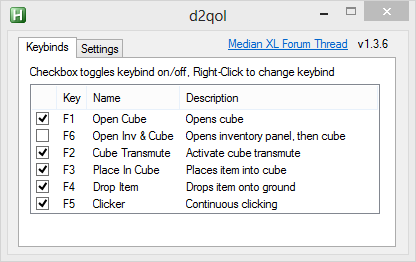
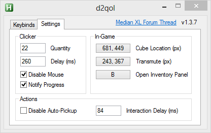
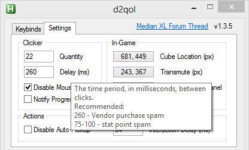
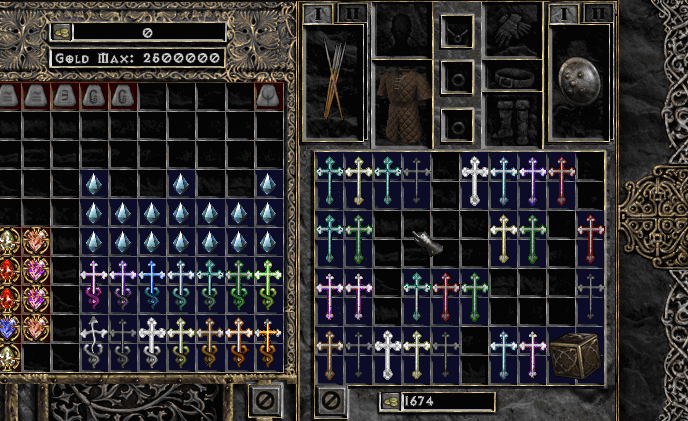

# d2QoL v1.5.0
## AutoHotKey based utility for a Diablo II mod Median XL to reduce stress on fingers and wrist.

Median XL's end-game requires highly repetitive crafting mechanics. Working with the cube slowly not only eats away at game time, but can also cause physical stress on the wrists and fingers. Since the nature of these actions is so well defined, it makes perfect target for automation. This was designed foremost as a crafting QoL utility, but it easily extends out to enhance normal gameplay.

This utility does nothing more than clicks on command in locations you have specified. There is no memory peeking, no gameplay logic, nothing outside the capabilities a human can perform.

General feedback and discussion is facilitated at the [Median XL forum thread](https://forum.median-xl.com/viewtopic.php?f=4&t=3302&sid=a2d830fa9aefb97dcc5264fc48caab65).

### Features
* Supports all resolutions
* GUI for configuration (no scripting required)
* Configurations are saved to d2qol.json on exit
* Any configuration inconsistencies are notified and offending items reverted to defaults
* Toggle action hotkeys on/off
* Actions only operate within Diablo II window
* Configure action behavior to cover various situations
* Hovering over settings will reveal more details about it's functionality
* Adjustable actions timing to compensate for latency issues

### Gui

### Install
Download [d2qol.exe](build/d2qol.exe).

### Usage
1. Run executable as Administrator (needs to send commands to the Diablo II window)
2. Configure hotkeys and settings

Setting | Description
--- | ---
Quantity | Amount of times for clicker to click the mouse
Delay | The time period, in milliseconds, between clicks.
Disable Mouse | Block any mouse movement during the clicking sequence.
Notify Progress | System tray tooltip showing sequence progress.
Cube Location | X & Y coordinates of the Horadric Cube.
Transmute Button | X & Y coordinates of the Horadric Cube's Transmute button.
Open Inventory Panel | In-game hotkey for opening the character inventory panel.
Disable Auto-Pickup | Disable auto pick-up during actions that involve moving items, requiring the item to be picked up before usage.
Interaction Delay | Time period, in milliseconds, to delay during interaction with the game client.

Quickly reducing shrines into vessels

### Bugs & Feedback
Tested under English version of Windows XP, 7, 8, 10. If you leave an issue report please include OS version, error messages, config data, and specific changes before the error occurred.

This was designed and tested under windowed 800x600 resolution and DDraw. Everything is based on user defined x,y locations, and the sequence of UI commands is nearly identical to human execution. *What can go wrong?™*

### FAQ
**Q**: Run As Administrator? How can I trust you?  
**A**: See [src/](src/) files

**Q**: This thing is broken and/or sucks balls  
**A**: Yes.

### Changelog
**1.5.0 - 6/10/18**
* Moved from 64-bit to 32-bit binary

**1.4.2 - 5/26/18**
* Added link to forum
* Updated clicker setting tooltip
* Removed unnecessary bits of code

**1.4.1 - 2/7/18**  
* Fixed an issue with releasing the mouse block during clicking sequence when window focus changes

**1.4.0 - 2/6/18**  
* Fixed settings not saving on Exit (only worked on Closing)
* Fixed hotkey logic that caused errors when trying assigning hotkey in various states
* Added more dynamic config file loading to account for changes in internal config data structure, no more manual fixing
* Added app icon to replace default AHK image
* Updated to a newer JSON library
* Updated overall consistency of code formatting/syntax
* Moved UI code layout to centralize definition and event handler code together in one place
* Updated certain variable names for clarity
* Moved version and forum link into new About tab
* Adjusted a few Tooltip strings

**1.3.7 - 1/17/18**  
* [Action] Refactored Action_Loop object: Now uses same object instead of recreating

**1.3.6 - 1/17/18**  
* [Action] Drop Item fixed: Now works in fullscreen mode

**1.3.5 - 1/16/18**  
* [UI] Notify Progress fixed: Parameter for handler function missing

**1.3.4 - 1/16/18**  
* [Settings] Action Interaction Delay Added: Can adjust for action click timing depending on latency
* [Settings] Clicker Notify Progress Added: Toggle system tray popup of progress
* [UI] Added setting tooltips to explain more details
* [App] Added versioning system with Major.Minor.Hotfix scheme
