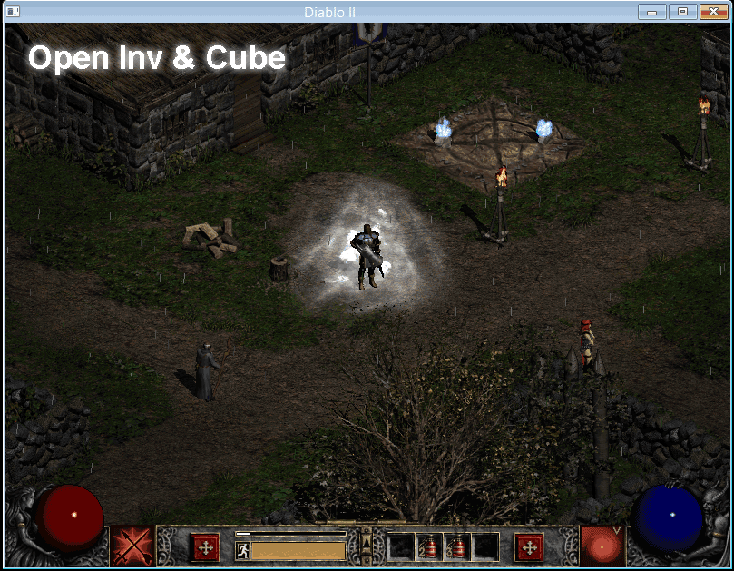
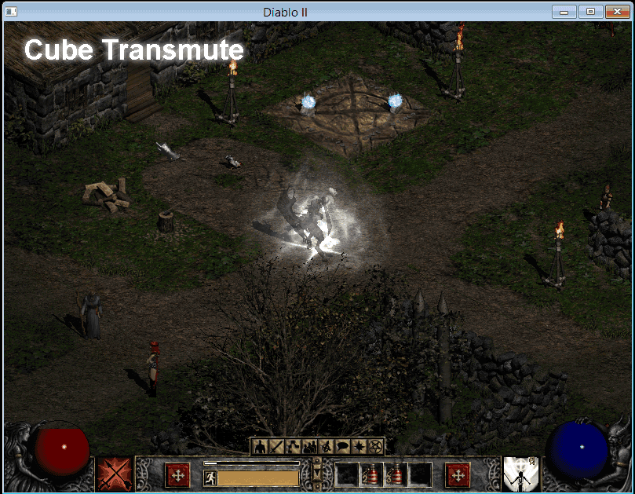
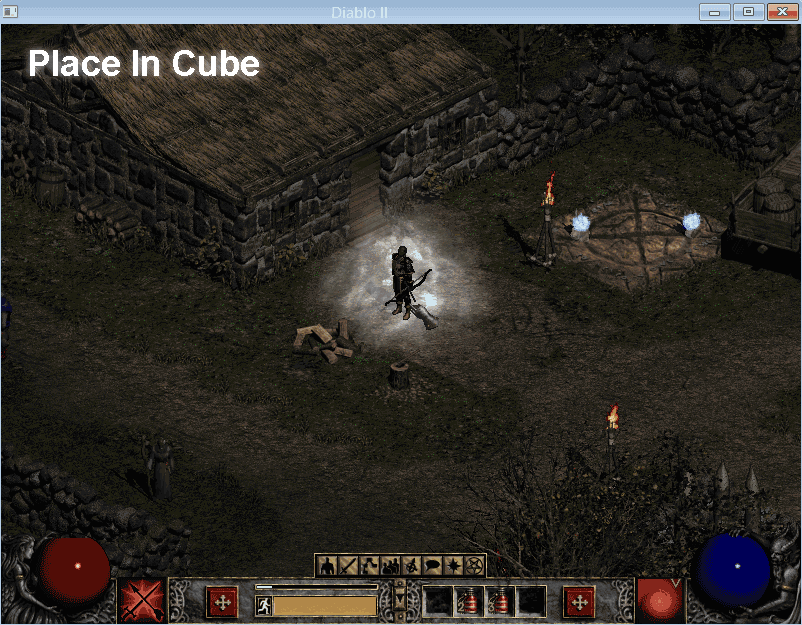
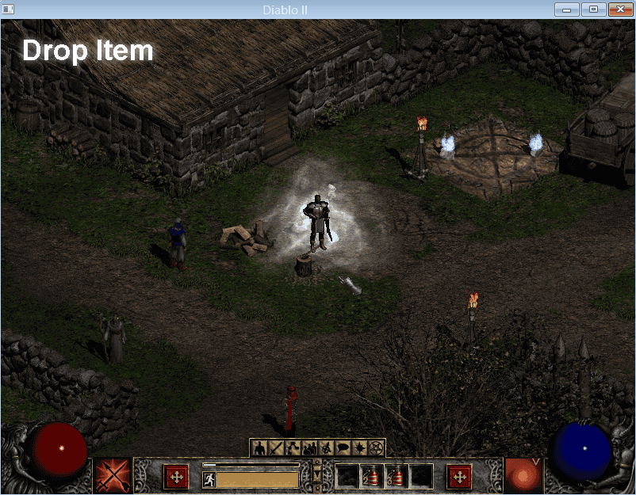
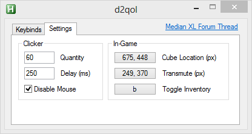

## d2QoL
Diablo II is old. The interface is old. Carpal Tunnel is real. This AutoHotKey program provides assistance for common tasks.

The goal is to replace the small, tedious, repetitive clicking sequences.  

Many gameplay activities are based on RNG, requiring huge amounts repitition. Despite being 'braindead' activities, the compounding nature adds up quickly.

### Install
Download [build/d2qol.exe](build/d2qol.exe).

### Usage
Run d2qol.exe **as administrator**. If you fail to use **Run As Administrator**, the AHK process will not be able to interact with the Diablo II process rendering this program flacid.

Action hotkeys will only be active/usable when the Diablo II window is focused.

On exiting the program, settings are saved to the file d2qol.json.

### Gui
The GUI offers configuration for the various actions and settings. Clicking the buttons will prompt with further configuration input.

##### Actions

|Action|Desc|
|--|--|
|Open Inventory & Cube|Opens inventory and cube|
|Cube Transmute|Activate Cube Transmute|
|Place In Cube|Places currently held item into cube|
|Drop Item|Drops currently held item onto ground|

##### Settings

|Setting|Desc|
|--|--|
|Cube (px)|x,y location of cube relative to window origin|
|Transmute (px)|x,y location of transmute button relative to window origin|
|Inventory Pane|In game shortcut key to open the inventory pane|

#### TroubleShooting/Quirks/Bugs/glhf
Some odd behavoir may occur. Most of them have been tested and fixed. Let me know if there is some faulty logic.

This was designed and tested under 800x600 resolution and DDraw. There is no reason for this to fail under other resolutions/scales.

Everything is based on user defined x,y locations, and the sequence of UI commands is nearly identical to human execution. *What can go wrong?™*

#### FAQ
**Q**: Run As Administrator? How can I trust you?
**A**: src/

**Q**: This thing is broken and/or sucks balls
**A**: Yes.

**Q**: 56k? Really?
**A**: I know, I know; I splurged. Most ISPs barely support V.90 modems, bastards are only facilitating 28.8k right now.